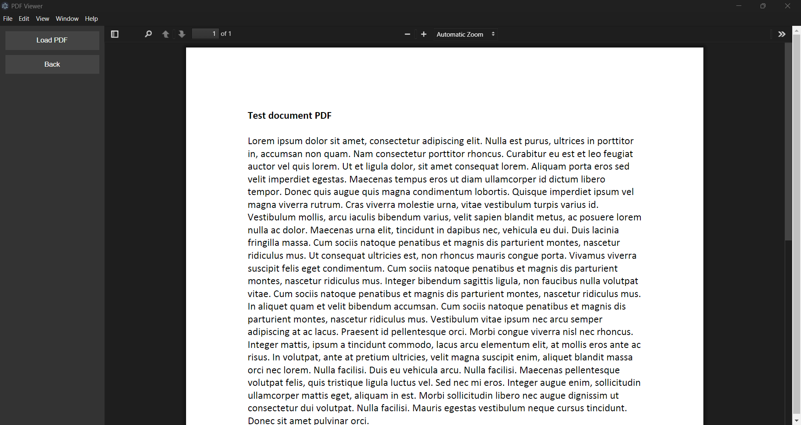

## Custom PDF Reader with Server (V3)

This version combines a custom-built PDF reader using PDF.js with a lightweight server to serve PDF files dynamically. 

What’s Inside:

- A custom PDF reader built with PDF.js.
- PDFs served dynamically from a pdf/ folder using an Express server.

### Screenshot
