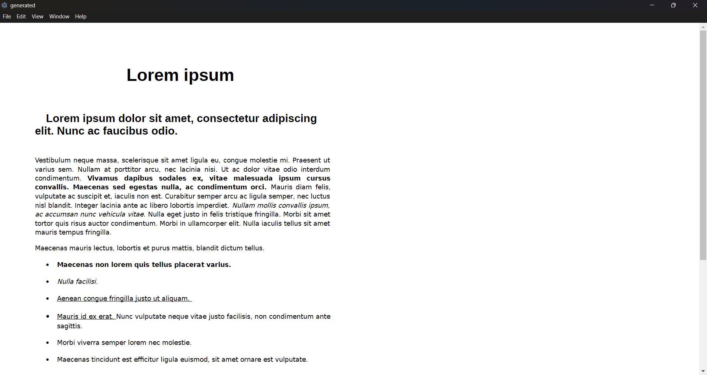

# POC_V4.5: PDF to HTML Conversion

This version explores possibility converting PDF documents into HTML format to improve control over how content is displayed.

## **Features**
- Converts each PDF page into a separate HTML file.
- Retains text and image rendering for each page.
- Explores executing a Python script directly from the Electron app.

### Screenshot
