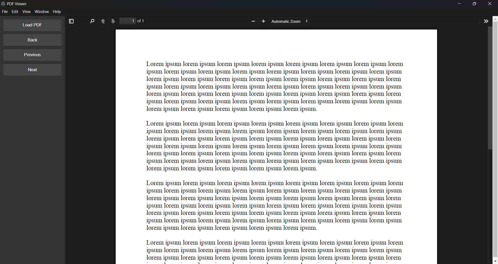

# POC_V5: PDF Encryption and On-Demand Decoding

This version explores encrypting PDF files into smaller chunks and decoding them one at a time for secure on-demand access.
- PDF is split into smaller encrypted chunks.
- Decryption occurs on-demand when a page is accessed.
- Decoded data is kept in memory temporarily and discarded once rendered.

### Screenshot
